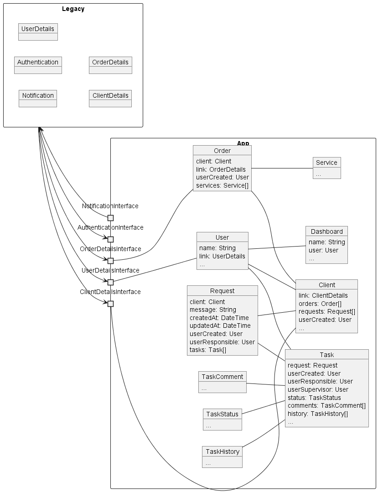

# Основные понятия

### Рабочее окружение:

* App - разрабатываемая система
* Legacy - существующая CRM проекта

### Глоссарий

* **Client** - Клиент. Содержит данные, которые непосредственно используются в нашем сервисе. Содержит идентификатор клиента в основной CRM, чтобы получать полные сведенья

* **Order** - Заказ клиента. Аналогично клиенту, содержит идентификатор в основной CRM, чтобы получать полные сведенья.

* **Service** - Позиция заказа

* **Request** - Обращение клиента. Содержит информацию о клиенте, текст обращения, даты создания, изменения, пользователя который принял обращение, ответственного пользователя

* **User** - Пользователь, с настройками относительно работы в системе, может содержать ссылку на пользователя из основной CRM

* **Dashboard** - Доска задач, создающаяся под пользователя системы, может содержать дополнительные параметры фильтрации, сортировки задач. Одна колонка - один статус задач.

* **Task** - Задача. Добавляются на основании **Request**, имеют статусы, комментарии, историю, ответственных, наблюдателей

### Интерфейсы интеграции App с внешней системой Legacy

* **UserDetailsInterface** - получение и поск данных по пользователям

* **NotificationInterface** - методы работы с рассылками и оповещениями

* **AuthenticationInterface** - метды работы с авторизацией и аутентификацией пользователя в системе, веротяно нужно предусмотреть и свою реализацию, если не указано обратное

* **ClientDetailsInterface** - метды работы с клиентами из осноной CRM (поиск, получение данных)

* **OrderDetailsInterface** - метды работы с заказами из осноной CRM (поиск, получение данных)

---

# Последовательность действий

