# 
Организационно–технологическое архитектурное решение (ОТАР) по задаче «Развитие CRM системы»

## Оглавление
- [История изменений](#история-изменений)
- [Термины и сокращения](#термины-и-сокращения)
- [Цель проекта/задачи](#цель-проектазадачи)
- [Бизнес-архитектура решения](#бизнес-архитектура-решения)
  * [Функциональная модель процессов](#функциональная-модель-процессов)
- [Информационная архитектура решения](#информационная-архитектура-решения)
  * [Потоки данных](#потоки-данных-data-flow-diagram)
  * [Бизнес-данные](#бизнес-данные)
- [Архитектура приложения](#архитектура-приложения)
  * [Концептуальная модель и интеграция](#концептуальная-модель-и-интеграция)
  * [Перечень компонентов](#перечень-компонентов)
  * [Выбор СУБД](#выбор-субд)
  * [Архитектура БД](#архитектура-бд)
  * [Выбор языка программирования](#выбор-языка-программирования)
  * [Модель компонентов приложений](#модель-компонентов-приложений)
  * [Модель развертывания приложений](#модель-развертывания-приложений)
  * [Open Api](#open-api)
- [Требования и решения по безопасности](#требования-и-решения-по-безопасности)

### История изменений

| *Номер версии*|    *Дата*   | *Автор изменения* |       *Суть изменения*        |
|:------------:|:------------:|:---------------:|:-------------------------------:|
| 1.0          | 01.12.2022   |                 | Первоначальная версия документа |

### Термины и сокращения
(Доменная модель)
| Термин\Сокращение | Значение         | Автор изменения |          Суть изменения         |
|-------------------|------------------|:---------------:|:-------------------------------:|
| Компания          | ПАО «Ростелеком» |                 | Первоначальная версия документа |
|                   |                  |                 |                                 |
|                   |                  |                 |                                 |

### Цель проекта/задачи

### Бизнес-архитектура решения
| Код | Название бизнес-процесса | Система автоматизации процесса | Интенсивность операций на дату внедрения (м/ч/д) | Интенсивность операций на конец года (м/ч/д) | Интенсивность операций на конец следующего года (м/ч/д) |
|:---:|:------------------------:|:------------------------------:|:------------------------------------------------:|:--------------------------------------------:|:-------------------------------------------------------:|
| БП1 |                          |               CRM              |                    1 / 5 / 15                    |                  1 / 5 / 60                  |                      2 / 935 / 160                      |
|     |                          |                                |                                                  |                                              |                                                         |
|     |                          |                                |                                                  |                                              |                                                         |

#### Функциональная модель процессов

Use-case diagrams

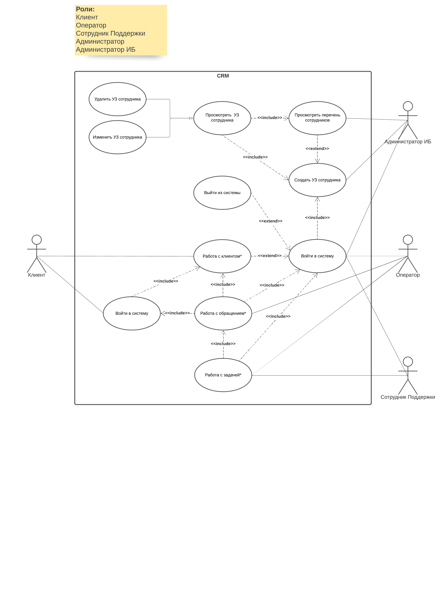

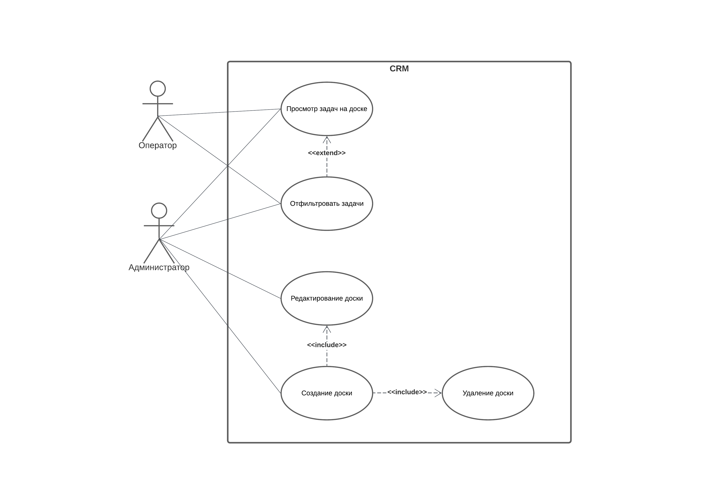
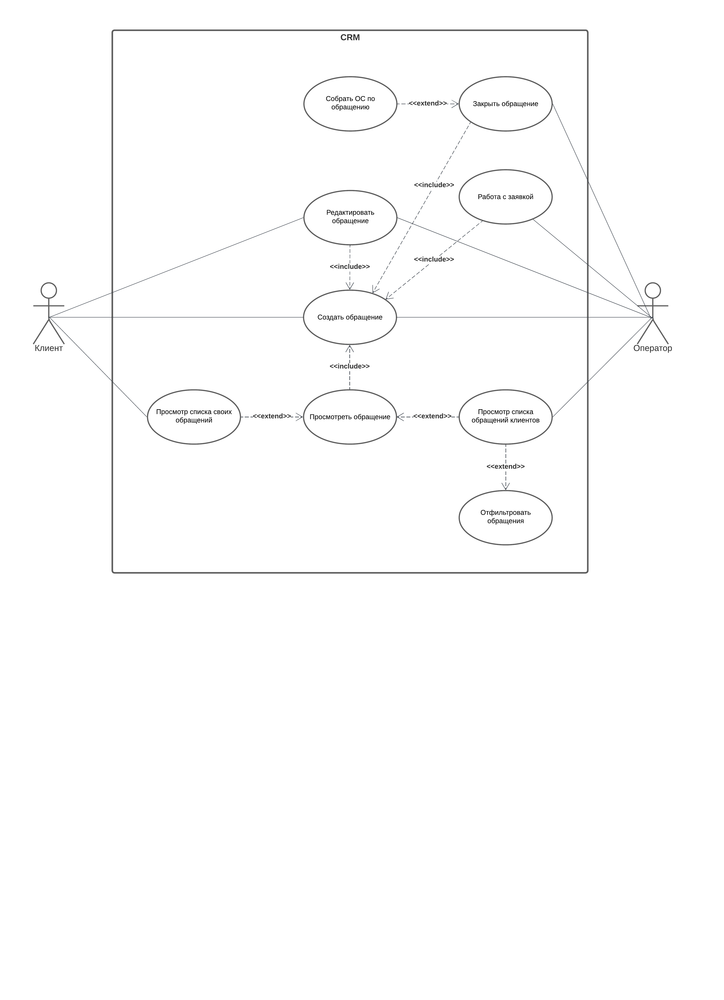
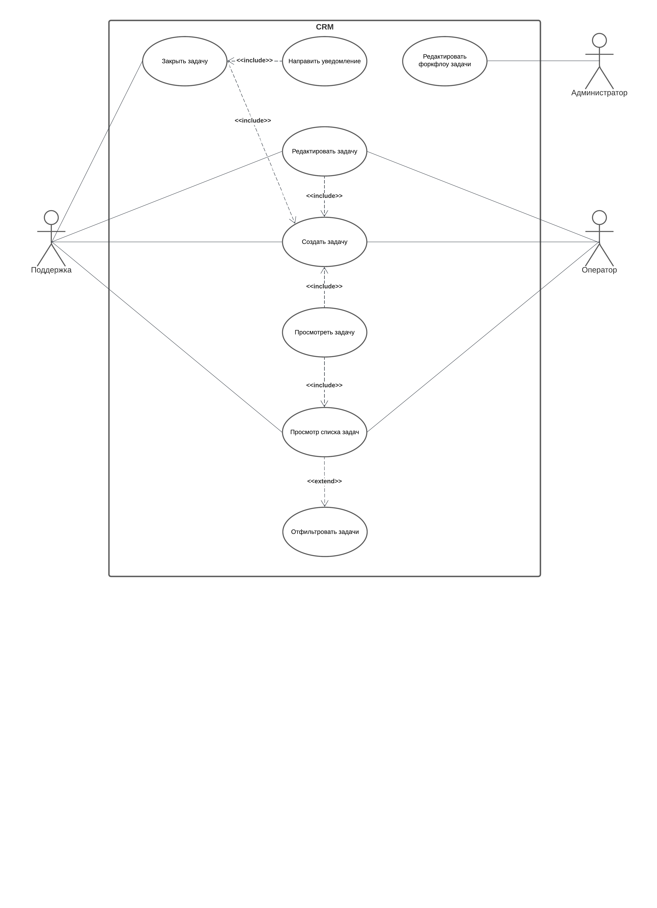

Sequence diagrams

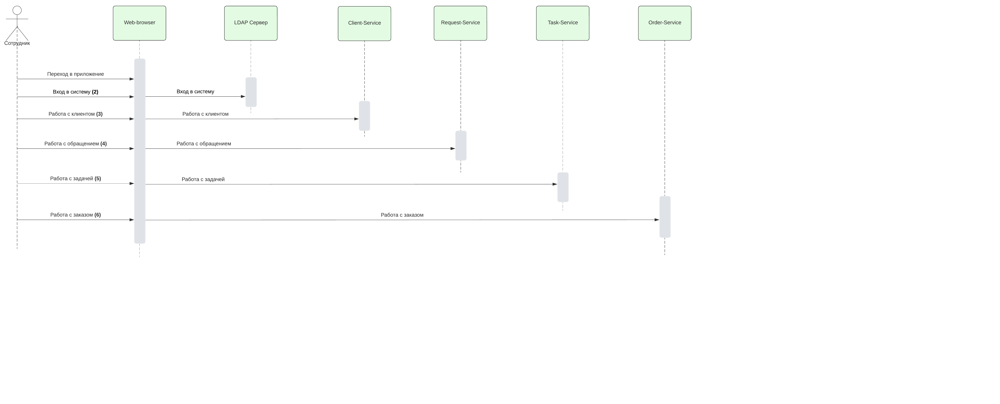
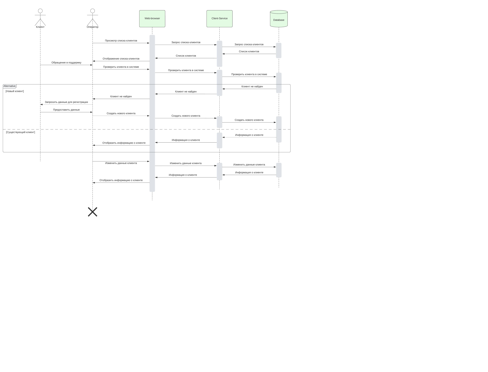
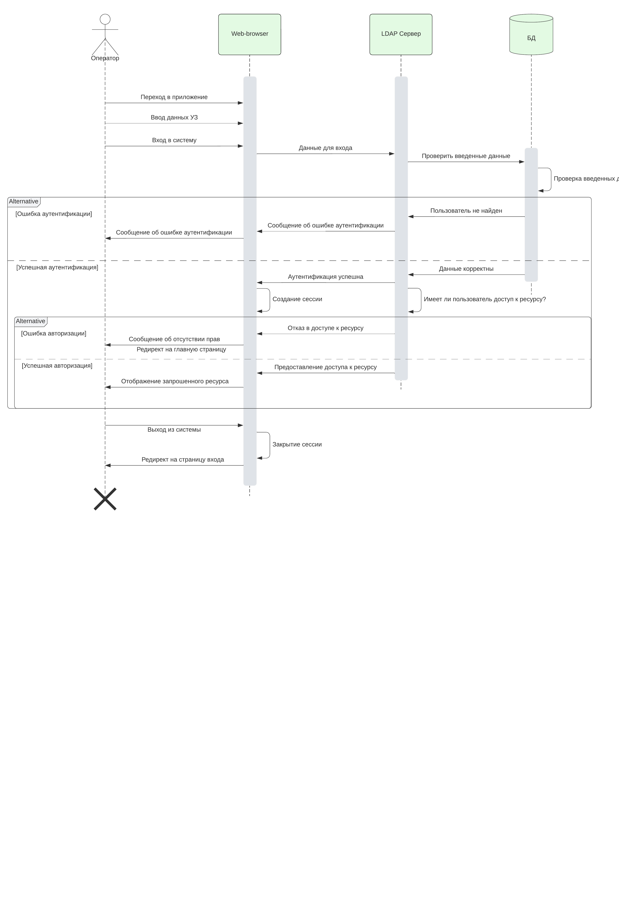
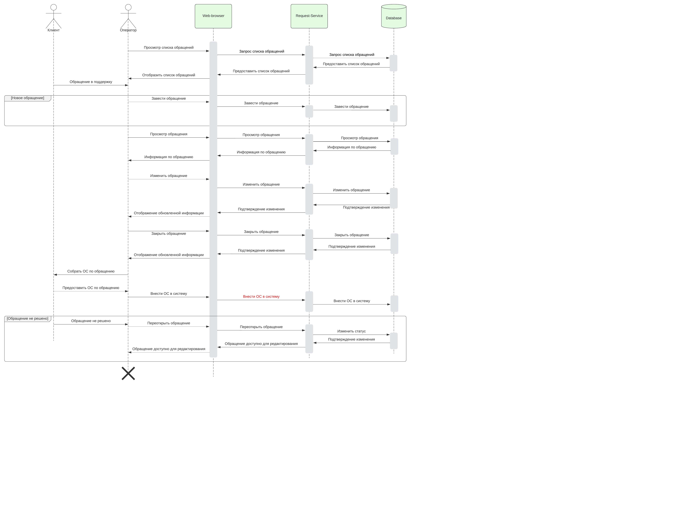
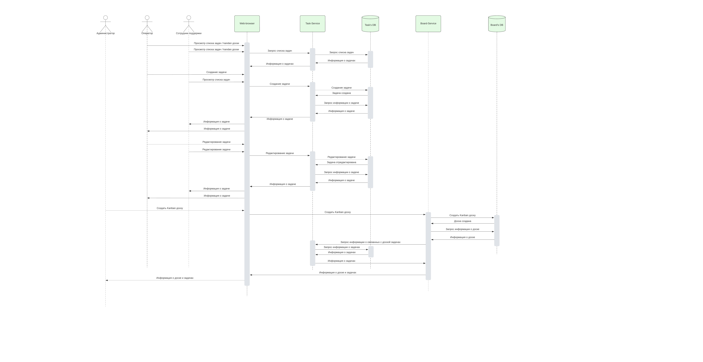

BPMN diagram

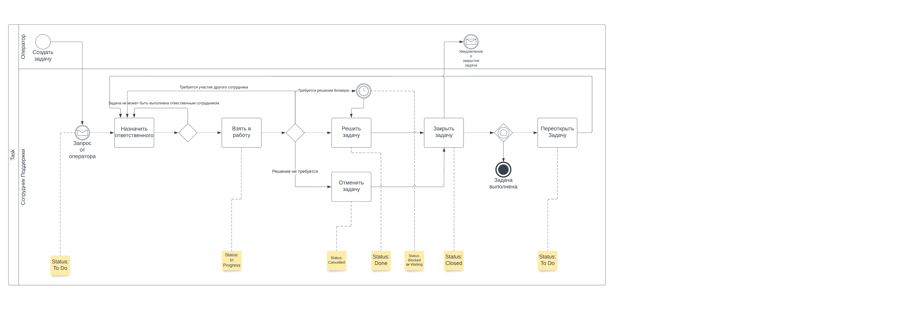

### Информационная архитектура решения

#### Потоки данных (data flow diagram)

  
Уровень 0

    

  
Уровень 1

    

#### Бизнес-данные
Можно заполнить по основным сущностям (+ приложить ER)
| № | Название объекта данных | Где хранится (системы) | Статус изменения   объекта данных | Объем данных | Глубина хранения |
|:---:|:---:|:---:|:---:|:---:|:---:|
|   | Событие по клиенту | DWH, CRM | Разработка | 200 ГБ | 5 лет |
|  |  |  |  |  |  |
|  |  |  |  |  |  |

### Архитектура приложения

#### Концептуальная модель и интеграция

  
Показать

   

#### Перечень компонентов
| № | Название системы/модуля/компонента | Тип объекта | Платформа | Назначение | Зона размещения компонента | Статус изменения   компонента |
|:---:|:---:|:---:|:---:|:---:|:---:|:---:|
|   | Client-service | Сервис | RHEL/Docker/Go | Решение для управления клиентами | LAN | Разработка |
|  |  |  |  |  |  |  |
|  |  |  |  |  |  |  |

#### Модель компонентов приложений

Диаграмма компонентов

  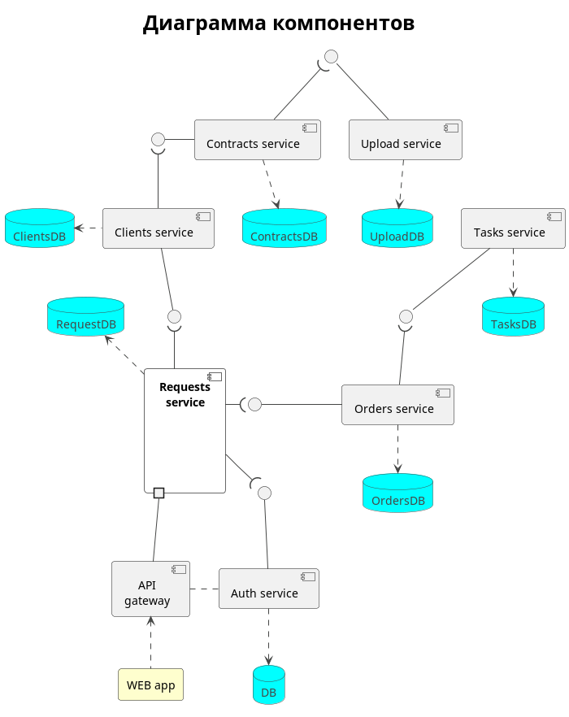

Диаграмма классов

  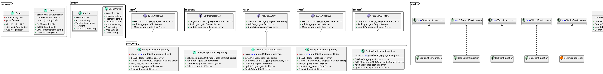

#### Выбор СУБД

Для проектируемого решения предлагается использовать следующие СУБД:
-	Postgres Pro Enterprise – для хранения и обработки транзакционных данных.
-	Виртуальное хранилище Ростелеком – для хранения файлов.

Выбор виртуального хранилища Ростелеком обусловлен использованием уже существующей инфраструктуру заказчика и поддержкой распространенного протокола Amazon S3 API.
СУБД Postgres Pro была выбрана в результате оценки критериев сравнения между наиболее распространенными реляционными СУБД (данный тип обеспечивает наиболее эффективную обработку транзакционных данных).

С учетом специфики заказчика, наиболее целесообразным является выбор СУБД Postgres, обладающей следующими преимуществами:
-	отсутствие санкционных рисков использования;
-	наличие вендоров осуществляющих поддержку и развитие на территории РФ;
-	наличие open source версии для исключения vendor lock.

Далее среди отечественных решений на основе СУБД Postgres был выбран продукт, имеющий реализацию высокодоступного (high availability) кластера «из коробки»: СУБД Postgres Pro Enterprise. Основным преимуществом реализации кластера СУБД Postgres Pro Enterprise является:
-	наличие конфигурации multimaster, позволяющей в отличии от других продуктов выполнять масштабирование операций не только на чтение, но и на запись;
-	использование разработанного расширения Postgres (без использования стороннего программного обеспечения) для создания и управления кластером.

 
Показать критерии

 
| Группа критериев | № | Критерий | Оценка от 1 до 10 (10 высшая оценка) |  |  |  |
|:---:|:---:|:---:|:---:|:---:|:---:|:---:|
|  |  |  | Oracle | My SQL | Microsoft SQL Server | Postgres |
| Оценка поставщика и его опыт | 1 | Наличие опыта применения в крупных компания мирового масштаба | 10 | 10 | 10 | 10 |
|  | 2 | Риски по ограничению поддержки или приобретению лицензий со стороны поставщика по политическим причинам (критичный критерий) | 1 | 5 (наличие open source | 1 | 10 |
|  | 3 | Наличие вендора на территории РФ осуществляющего поддержку и развитие продукта | 1 | 1 | 1 | 10 |
|  |  | Итого: | 12 | 16 | 12 | 30 |
| Функциональность | 4 | Соответствие функциональным требованиям в целом (сумма) | 40 | 40 | 40 | 33 |
|  | 4.1 | Поддержка OLTP типа обработки данных  (ACID транзакции) | 10  | 10 | 10 | 10 |
|  | 4.2 | Partitioning (разделение строк по физическим разделам) | 10 | 10 | 10 | 10 |
|  | 4.3 | Sharding (разделение строк по нодам) | 10 | 10 | 10 | 5 (ручное с расширением FDW) |
|  | 4.4 | Возможности масштабирования решения | 10 (Oracle RAC) | 10 (3rd party в бесплатной и Built-in в платной) | 10 (WSFC и технология AlwaysOn) | 8 (3rd party в бесплатной версии без масштабирования на запись и Built-in в платной)  |
|  | 5 | Соответствие нефункциональным требованиям в целом (сумма) | 14 | 30 | 13 | 23 |
|  | 5.1 | Наличие Open Source версии (отсутствие зависимости от услуг конкретного поставщика)  |  1 | 10 | 1 | 10 |
|  | 5.2 | Место в рейтинге RDBMS СУБД (по данным https://db-engines.com/en/ranking_trend/relational+dbms) | 10 | 10 | 7 | 5 |
|  | 5.3 | Оценка количества специалистов использующих СУБД (по данным https://insights.stackoverflow.com/survey/2021#key-territories-country)  | 3 | 10 | 5 | 8 |
|  |  | ИТОГО: | 66 | 86 | 65 | 86 |

Таблица отечественных продуктов на основе СУБД Postgres

| №п.п. | Наименование продукта | Вендор | Наличие кластера масштабируемого на запись и чтение |
|:---:|:---:|:---:|:---:|
|  1| Postgres Pro Enterprise | Postgres Pro | Да |
| 2 | СУБД Tantor | "Лаборатории Тантор" | Нет |
| 3 | СУБД Jatoba | Газинформсервис | Нет |
| 4 | Platform V Pangolin | Сбербанк-Технологии | Нет |
| 5 | СУБД “Квант- Гибрид” | О «Концерн ГРАНИТ»  | Нет |
| 6 | Arenadata Postgres | Arenadata | Нет |
| 7 | СУБД "ЛИРА-Р" | НППКТ   | Нет |

#### Архитектура БД

Масштабирование

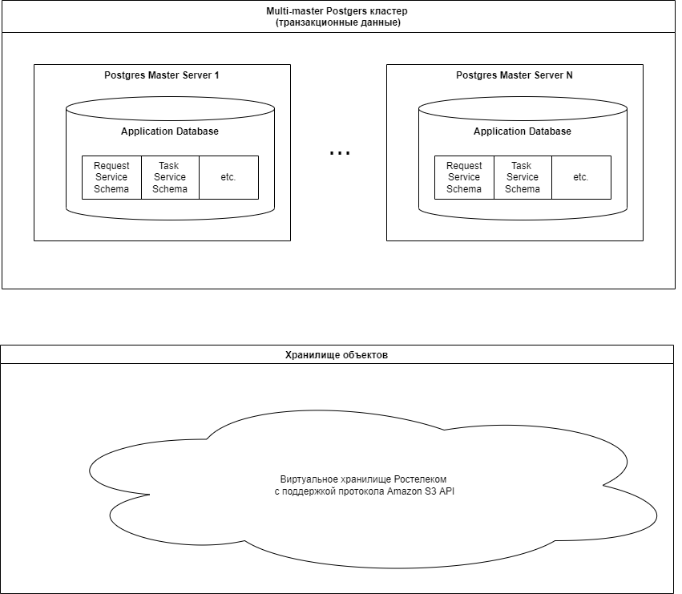

Катастрофоустойчивость

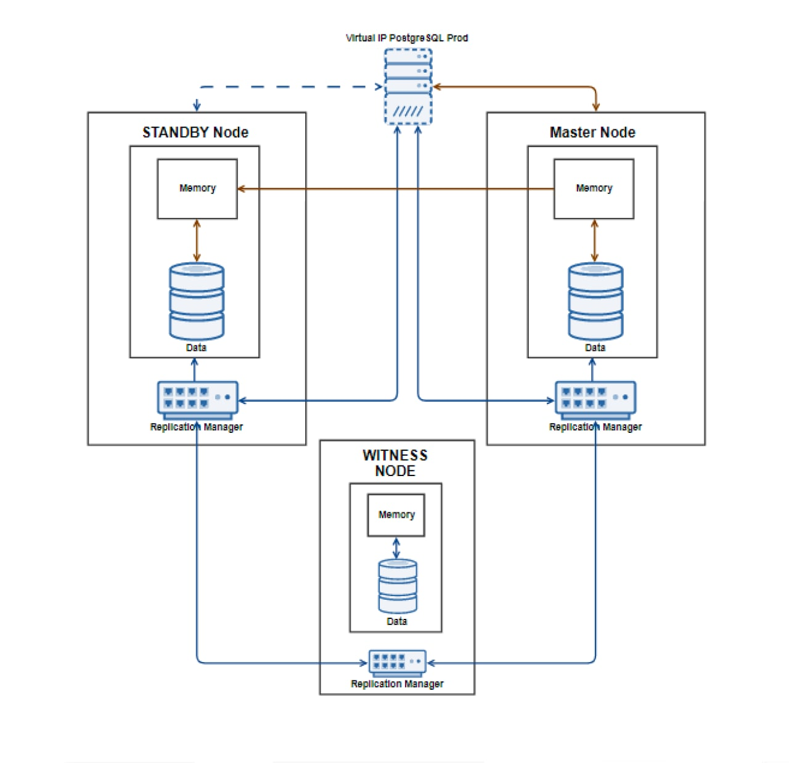

#### Выбор языка программирования

##### GoLang
| Плюсы                                             | Минусы                                              |
|:--------------------------------------------------|:----------------------------------------------------|
| Статическая типизация                             | Обработка ошибок требует написания док кода         |
| Идеально подходит при написании микросервисов     | Трудночитаемая документация                         |
| Компилируемый на любую платформу                  | Сложен для понимания при переходе с ООП             |
| Конкурентность выраженная в легковесных горутинах | Нет стандартизированных рекомендаций написания кода |
| Есть дженерики                                    |                                                     |
| Низкий порог вхождения                            |                                                     |
| Отсутствие исключений                             |                                                     |
| Большое сообщество                                |                                                     |
| Нет полной реализации ООП                         |                                                     |
| Можно легко работать с любым протоколом           |                                                     |
| Можно спрогнозировать объем потреб ресурсов       |                                                     |
| Надежный                                          |                                                     |
| Возможность подключать сторонние библиотеки С/С++ |                                                     |

##### PHP
| Плюсы                                      | Минусы                                                      |
|:-------------------------------------------|:------------------------------------------------------------|
| Полноценное ООП                            | Динамическая типизация                                      |
| Параллелизм                                | Не компилируемый                                            |
| Воркеры                                    | Низкая скорость работы                                      |
| Обработка ошибок                           | Завершает процесс при каждом вызове                         |
| Низкий порог входа                         | Требует сторонний веб сервер для работы                     |
| Огромное сообщество                        | Динамическая типизация                                      |
| Огромное количество готовых решений        | Только для CLI и веб                                        |
| Дешевая стоимость часа работы программиста | Слабо контролируемое потребление ресурсов                   |
| Хороший программист - редкость             | Вынужденность применения фреймворков уменьшает безопасность |
| Отличная документация                      |                                                             |
| Рекомендации написания кода PSR            |                                                             |

В современных проектах применяется комбинация этих двух языков - [RoadRunner](https://roadrunner.dev/), когда препроцессор PHP находится в обертке Go, таким образом процесс PHP является "не убиваемым".
Но такие решения чаще распространяются на устоявшиеся проекты, которые требуют увеличения производительности.
И в затраты на них учитывается работа программистов обоих стеков. Само решение "сырое" и что также
рискованно к применению.

Язык Go отлично подходит для реализации небольших, стабильно работающих приложений,
может быть скомпилирован на любую платформу. Писать на нем "идиоматически верно" при
переходе с ООП языков трудно, что занимает время и желательно наличие грамотного (дорогого)
наставника. Не рекомендуется для написания больших монолитных проектов. Не требует
стороних сервисов для работы, что также облегчает разворачивание приложения в кластере k8s.
Прекрасно работает с protobuf через gRpc, что облегчает взаимодействие между сервисами из-за
вынужденного соблюдения интерфейсов. Что дает гарантию целостности данных и их
правильного восприятия. Минимальная вероятность появления панических
ошибок и надежность исполнения кода - основная причина выбора этого языка. Наличие
в команде опытного специалиста - гарантия быстрого включения в проект любого специалиста
при переходе с любого языка программирования, за кротчайшее время.

В то же время низкий уровень безопасности из-за необходимости использования сторонних фреймворков в PHP,
возможность программирования в разных стилях, приводящее к увеличению тех долга,
сложное разворачивание в кластере. Слабо контролируемое потребление ресурсов
в комбинации с правилами ограничения потребления ресурсов кластера, может привести к
сбоям и потерям пакетов. В результате низкие затраты на специалистов на этапе старта проекта
приведет к очень дорогой поддержке в будущем, потери данных, неявным ошибкам, и большим затратам
на трафик и железо.

##### Сравнительная таблица производительности ЯП

Использовались данные с сайта https://benchmarksgame-team.pages.debian.net/benchmarksgame/

| Тест         | PHP 8.1.5 (cli)    | GoLang (1.18) |
|--------------|--------------------|---------------|
| sqrt in loop | 22.14ms            | 7.42ms        |
| regexp       | 924ms              | 297ms         |
| binary-tree  | 830ms              | 240ms         |
| file IO      | 58ms               | 17ms          |

#### Модель развертывания приложений

Диаграмма развертывания

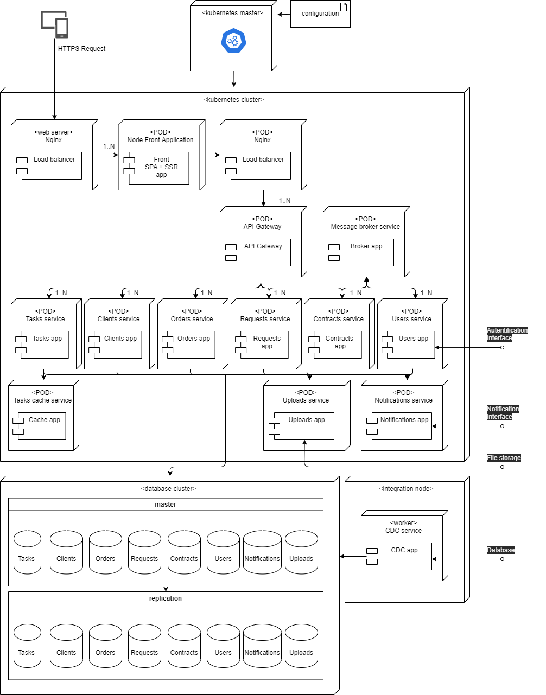

#### Open Api

Open API

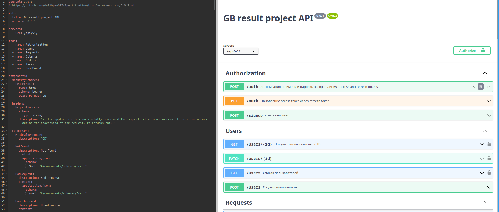

### Требования и решения по безопасности
Система должна удовлетворять требованиям Постановления Правительства РФ от 01.11.2012 N 1119 "Об утверждении требований к защите персональных данных при их обработке в информационных системах персональных данных". 
